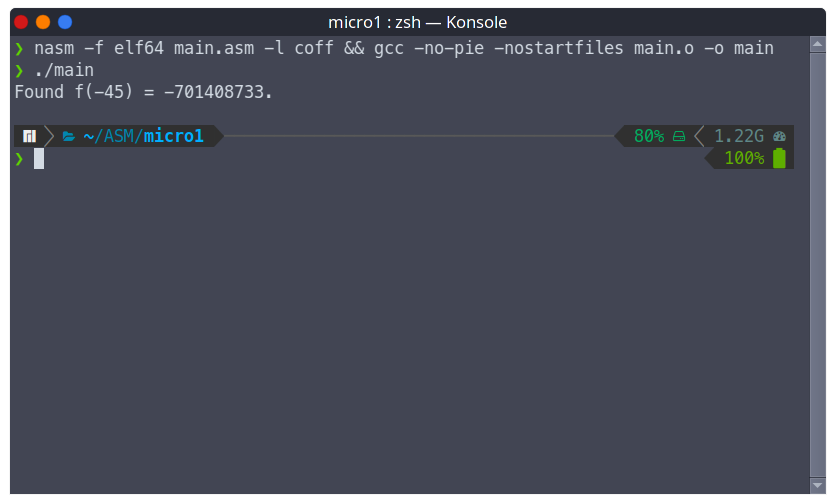

# Table of Contents

1.  [Текст задания](#org8c22ea2)
2.  [Сборка и запуск](#orgc832707)
    1.  [Компиляция и сборка](#orgc8bfe9a)
    2.  [Запуск](#org79213d2)
3.  [Приложение](#org20116e2)
    1.  [Исходный код](#org5401736)
    2.  [Тестовый пример](#org4207342)

[PDF версия](./README.pdf)

# Текст задания

Разработать программу, которая определяет
максимальное значение параметра числа линейной
рекуррентной последовательности
\(f_{n} = f_{n+2} - f_{n+1}\) при \(n \leq -2\) (&ldquo;числа Фибоначчи&rdquo;)
со стартовой последовательностью `[0,1]` в
отрицательной области значений, не выходящее
за пределы целого со знаком \(= 10^9\)

# Сборка и запуск

## Компиляция и сборка

    nasm -f elf64 main.asm
    gcc -no-pie -nostartfiles main.o -o main

## Запуск

    ./main

    Found f(-45) = -701408733.

# Приложение

## Исходный код

[main.asm](main.asm)

        SECTION .rodata
    
        format      db  "Found f(%d) = ", 0h
        format2     db  "%d.", 0xA, 0h
        limit       dd  1000000000
    
        SECTION .data
    
        _n2         dd  0
        _n1         dd  0
        _n          dd  1
        n           dd  -2
    
        SECTION .text
    
        global _start
        extern printf
        extern exit
    
    _start:
    
    while:
        mov eax, dword[_n1]         ; _n2 = _n1
        mov dword[_n2], eax
    
        mov eax, dword[_n]          ; _n1 = _n
        mov dword[_n1], eax
    
        mov eax, dword[_n2]         ; _n = _n2 - _n1
        sub eax, dword[_n1]
        mov dword[_n], eax
    
        dec dword[n]                ; n--
    
        mov eax, dword[_n]
    
        cmp eax, 0
        jge skipAbs
        neg eax
    
    skipAbs:
        cmp eax, dword[limit]       ; if (_n < limit)
        jl while                    ;   goto while
    
        mov esi, dword[n]           ; arg2 = n
        inc esi                     ; arg2++
    
        mov rdi, format             ; arg1 = format
        xor rax, rax
        call printf                 ; printf(format, n - 1)
    
        mov rdi, format2            ; arg1 = format2
        mov rsi, [_n1]              ; arg2 = _n1
        xor rax, rax
        call printf                 ; printf(format2, _n1)
    
        xor edi, edi                ; arg1 = 0
        call exit                   ; exit(0)

## Тестовый пример

